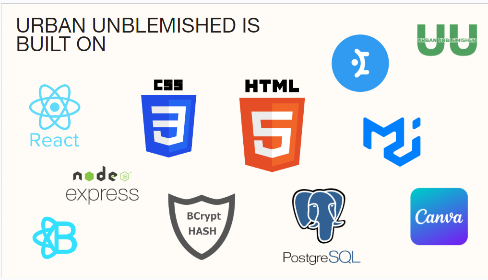
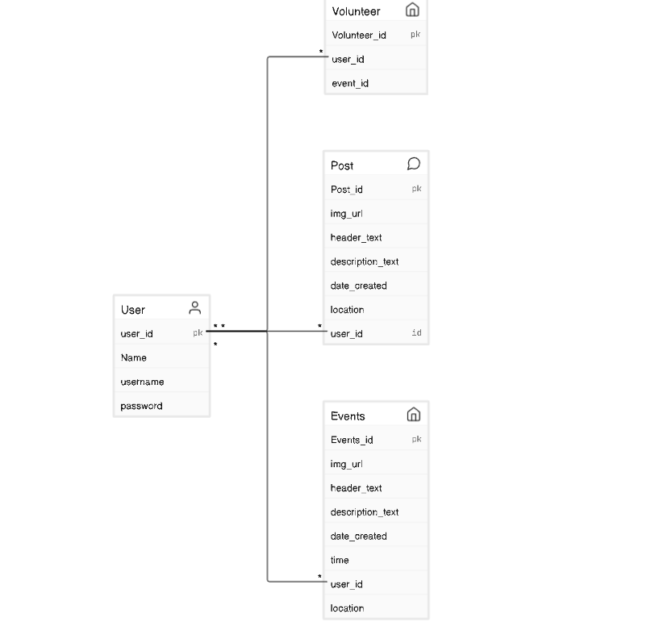

# MayaSnax

### Getting Started

1. Fork this template repo
2. Create a PostgreSQL database
3. Create a `.env` file and define environment variables for your PostgreSQL credentials. See the `knexfile.js` file for needed variables.
4. Run the command `npm run kickstart`

### Mission Statement

Urban Unblemished is a dedicated application that promotes a cleaner and vibrant NYC by empowering residents to actively participate in keeping the streets clean, ultimately fostering a healthier environment and community pride.

### Who We Serve

Urban Unblemished serves civilians and residents of the NYC area who are passionate about maintaining a clean and vibrant environment. Our product will uniquely serve our audience by providing a platform for reporting issues and making it easy for users to volunteer as part of the solution to the issue.

### Product Overview

* **Urban-Unblemished Selection**: Unblemished will allow users to make general posts to incite discussion about polluted areas [including a photo and description].
* **Wide Variety of Options**: When logged in, Users can view the Events page, read information about events as well as RSVP.
* **Feedback**: Users can organize cleaning events in areas that are dirty.

### Summary
Littering in New York City has far-reaching consequences, including creating an unsightly environment, promoting rat infestation, and diminishing the overall quality of life for residents and visitors. Addressing the issue of littering is crucial to mitigate the associated problems and enhance the well-being of the city's inhabitants.

### Technologies  
We built Urban-Unblemished using the following technologies:

The frontend was built using HTML, CSS, JavaScript, React, and MaterialUI. The backend was built using Node and Express, bcrypt for password hashing, a PostgreSQL database, and Knex to connect our server to our database.

### ERD

To manage the data necessary for the MayaSnax backend, we have implemented the following schema in our PostgreSQL database:

### Key API Endpoints

The Urban-Unblemished API provides the following endpoints:

| endpoint | description | example |
| - | - | - |
| `/api/post` | Get all possible post options | `GET /api/post` |
| `/api/post` | Creat a Post | `POST /api/post` |
| `/api/post/:post_id` | Delete a Post | `DELETE /api/post/1` |
| `/api/volunteer` | Save User that RSVP to that particular event| `POST /api/volunteer` |
| `/api/events` | Get all possible event options | `GET /api/events` |
| `/api/events` | Creat a event | `POST /api/events` |
| `/api/events/:event_id` | Delete a event | `DELETE /api/events/6` |

